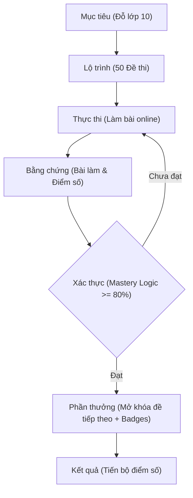

# A2. USECASE DIAGRAM (VÒNG LẶP TRÁCH NHIỆM)

## 1. BỐI CẢNH & MỤC TIÊU
Trong hệ điều hành DAC, một Use case không đơn thuần là một hành động (Action), mà là một **Vòng lặp Trách nhiệm (Accountability Loop)**. Mục tiêu là chuyển hóa mọi nỗ lực của người dùng thành kết quả có thể xác thực.

## 2. TRIẾT LÝ & LOGIC NGẦM
*   **Hệ điều hành kết quả (Outcome OS)**: Coi hệ thống là một "máy ép" nỗ lực thành thành tựu.
*   **Khung lý thuyết**: 
    *   **Cybernetic Feedback Loop**: Điều khiển hành vi thông qua phản hồi.
    *   **Hook Model (Nâng cao)**: Gợi nhắc -> Thực thi -> Bằng chứng -> Xác thực -> Phần thưởng.

## 3. CẤU TRÚC NỘI DUNG (PHÂN LOẠI THEO PRD v1.3)
Hệ thống xoay quanh 3 vai trò cốt lõi và các hành động tạo ra bằng chứng:
*   **The Runner (Học sinh)**: Thực thi nỗ lực học tập.
*   **The Coach (Gia sư)**: Điều phối, hướng dẫn và kiểm chứng.
*   **The Supporter (Phụ huynh)**: Theo dõi và đồng hành.

## 4. TIÊU CHUẨN THỰC THI (STANDARDS)

### 4.1. Core Loop Diagram (Áp dụng cho Exam Runner)

### 4.2. Bảng Mô tả Use-case (Dựa trên PRD)
| ID | Tên Use-case | Vai trò | Bằng chứng (Proof) | Cách Xác thực |
|:---|:---|:---|:---|:---|
| **UC-A-01** | Làm bài thi online | Học sinh | Bài làm đã nộp, Điểm số | Hệ thống chấm tự động |
| **UC-A-02** | Ôn tập Flashcard & Skill Drill | Học sinh | Bảng theo dõi XP, Mastery Level | Thuật toán Spaced Repetition |
| **UC-A-03** | Xem giải thích & Adaptive Retry | Học sinh | Log bài sửa lỗi thành công | Kiểm chứng qua Active Recall |
| **UC-B-01** | Thiết lập kho đề (Local Admin) | Gia sư | Dữ liệu đề thi trong DB cục bộ | Xác thực mã PIN Gia sư thành công |
| **UC-B-02** | Điều chỉnh Lộ trình / Ngày thi | Gia sư | Deadline mới được cập nhật | Xác thực mã PIN Gia sư thành công |
| **UC-C-01** | Xem báo cáo tiến độ (Parent Mode) | Phụ huynh | Hiển thị Dashboard Phụ huynh | Xác thực mã PIN Phụ huynh thành công |

## 5. BIẾN THỂ & TRƯỜNG HỢP BIÊN (EDGE CASES)
*   **Học sinh không đạt Mastery**: Phải làm lại đề. Hệ thống cần hỗ trợ hiển thị lại các câu sai và giải thích để học sinh tự học trước khi thi lại.
*   **AI tạo giải thích lỗi**: Gia sư cần có quyền can thiệp và chỉnh sửa giải thích mẫu của AI.

## 6. RULES (AUDIT QUESTIONS)
1. Use-case này có tạo ra **Bằng chứng (Proof)** không? Nếu không, hãy xóa bỏ.
2. Ai là người **Xác thực (Verify)**? Nếu là máy, độ chính xác bao nhiêu? Nếu là người, thời gian phản hồi là bao nhiêu?
3. Có **Điểm rò rỉ (Leak)** nào khiến người dùng có thể "đứng hình" vì không biết làm gì tiếp theo không?
