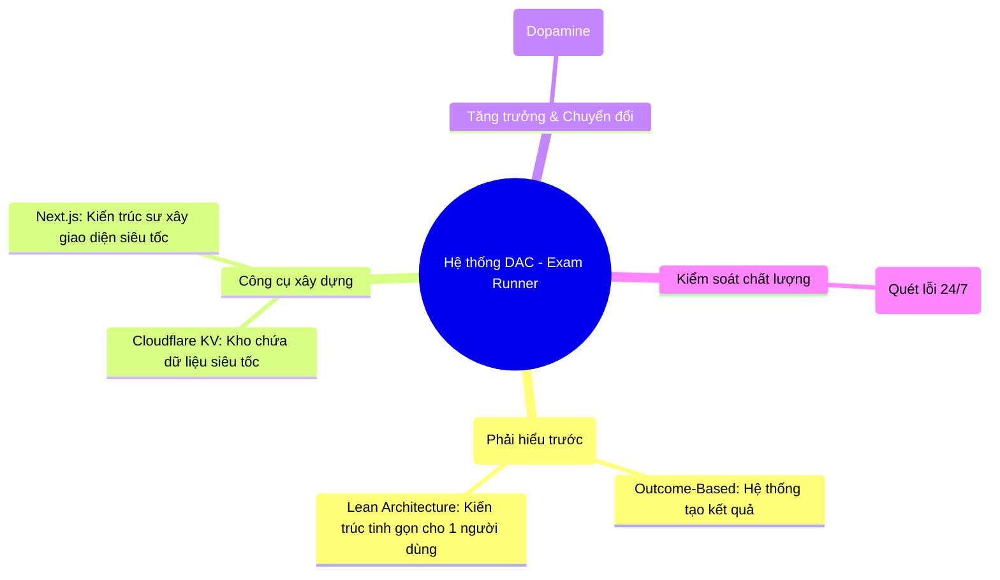

# B0. WIKI HỆ SINH THÁI KỸ THUẬT (SYSTEM DESIGN WIKI)

## 1. BẢN ĐỒ KHÁI NIỆM (MINDMAP)
*Sơ đồ này giúp bạn hình dung toàn bộ các thành phần kỹ thuật kết nối với nhau như thế nào để tạo ra kết quả.*

## 2. BẢNG TRA CỨU NHANH (THEO MỨC ĐỘ ƯU TIÊN)
*Dành cho Manager cần nắm bắt nhanh những khái niệm sống còn của dự án.*

| Ưu tiên | Thuật ngữ | Giải thích cho người không chuyên | Giai đoạn |
| :--- | :--- | :--- | :--- |
| **1** | **Outcome-Based System** | Hệ thống tập trung vào việc tạo ra **kết quả thực tế** cho người dùng. | Toàn bộ |
| **2** | **Cloudflare KV** | "Tủ locker mini" siêu tốc để lưu trữ dữ liệu đề thi và tiến độ. | Xây dựng |
| **3** | **Playwright** | "Thanh tra tự động". Tự động đi kiểm tra xem các nút bấm có chạy không. | Kiểm soát |

---

## 3. BẢNG CÔNG CỤ & TRƯỜNG HỢP SỬ DỤNG (TOOLS & USE CASES)

| Công cụ | Dùng để làm gì? (Use Case) | Tại sao Manager cần quan tâm? | Giai đoạn |
| :--- | :--- | :--- | :--- |
| **Cloudflare** | Lưu dữ liệu (KV) và bảo mật hệ thống. | Gọn nhẹ, không tốn chi phí quản lý server phức tạp. | Xây dựng |
| **Next.js** | Xây dựng giao diện Web. | Tốc độ tải trang cực nhanh, hỗ trợ tốt cho SEO. | Thu hút khách |
| **Sentry** | Ghi lại lỗi khi khách hàng gặp sự cố. | Giúp kỹ thuật sửa lỗi ngay lập tức. | Bảo trì |

---

## 4. TỪ ĐIỂN THUẬT NGỮ TOÀN TẬP (ALPHABETICAL GLOSSARY)

| Nhóm (Parent) | Thuật ngữ (Sub-term) | Giải thích đơn giản cho Non-Tech | Giai đoạn |
| :--- | :--- | :--- | :--- |
| **Dữ liệu (Data)** | JSON | Định dạng dữ liệu dạng text nhẹ nhàng, dễ đọc hiểu. | Xây dựng |
| **Dữ liệu (Data)** | Key-Value (KV) | Cách lưu dữ liệu theo cặp Khóa - Giá trị (như tra từ điển). | Xây dựng |
| **Giao diện (UI/UX)** | Vanilla CSS | Tự may đo giao diện thủ công để đạt độ mượt tối đa. | Thiết kế |
| **Giao diện (UI/UX)** | Micro-interactions | Các hiệu ứng nhỏ khi bạn di chuột hoặc bấm nút, tạo cảm giác cao cấp. | Thiết kế |
| **Hạ tầng (Arch)** | Serverless | Chạy code mà không cần thuê và quản lý máy chủ riêng. | Quy hoạch |

---
*Wiki này là tài liệu sống, sẽ được cập nhật liên tục theo sự phát triển của hệ thống DAC.*
