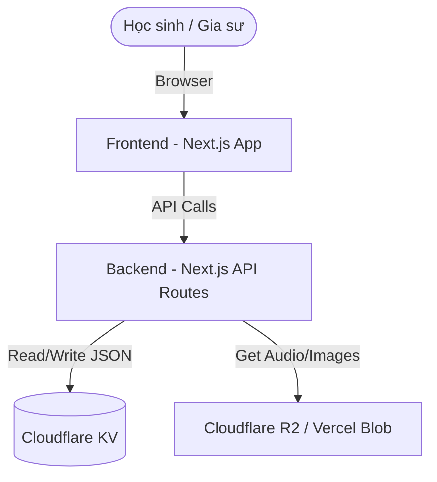

# Kiến trúc Hệ thống (System Architecture) - Exam Runner

Tài liệu này mô tả kiến trúc tổng thể của hệ thống Exam Runner. Vì hệ thống hiện tại chỉ phục vụ **1 học sinh duy nhất**, kiến trúc được thiết kế theo hướng **Lean (Tinh gọn)**, ưu tiên tốc độ triển khai và không tốn chi phí vận hành.

---

## 1. Đề xuất Tech Stack

*   **Frontend & Backend (Fullstack)**: **Next.js** (React Framework).
    *   *Lý do*: Hỗ trợ cả giao diện người dùng và API Routes (Serverless Functions) trong cùng một project.
*   **Database / Storage**: **Cloudflare KV** (Key-Value Storage).
    *   *Lý do*: Gọn nhẹ, lưu trữ dạng JSON rất phù hợp với cấu trúc đề thi linh hoạt. Miễn phí và chạy cực nhanh.
*   **Styling**: **Vanilla CSS**.
    *   *Lý do*: Tự do "may đo" các hiệu ứng chuyển động mượt mà đỉnh cao kiểu Brilliant.
*   **Hosting/Deployment**: **Cloudflare Pages** (Hoặc Vercel).

---

## 2. Sơ đồ Khối Kiến trúc (High-Level)

---

## 3. Các luồng xử lý chính (Core Flows)

### 3.1 Luồng Luyện đề (Exam Flow)
1.  Học sinh chọn đề -> FE gọi `GET /api/v1/exams/:id`.
2.  BE lấy chuỗi JSON từ Cloudflare KV (Key `exam:id`), ẩn đáp án và giải thích -> Trả về FE.
3.  Học sinh làm bài, nộp bài -> FE gọi `POST /api/v1/exams/:id/submit`.
4.  BE tính điểm, cập nhật lịch sử vào Key `progress` trong KV, lấy full giải thích -> Trả về kết quả cho FE.

### 3.2 Luồng Học Flashcard (Spaced Repetition Flow)
1.  FE gọi `GET /api/v1/flashcards/due`.
2.  BE đọc Key `progress` và `flashcards` từ KV để lọc ra các thẻ đến hạn ôn tập -> Trả về FE.
3.  Học sinh lật thẻ, đánh giá mức độ nhớ -> FE gọi `POST /api/v1/flashcards/:id/review`.
4.  BE tính toán ngày ôn tiếp theo (thuật toán Spaced Repetition) -> Cập nhật lại Key `progress` trong KV.

---

## 4. Bảo mật & Xác thực (Với bối cảnh 1 Học sinh)
*   Không cần hệ thống phân quyền phức tạp.
*   Chỉ cần một lớp Password bảo vệ cơ bản (Basic Auth) hoặc dùng NextAuth.js giới hạn duy nhất email của học sinh và gia sư/phụ huynh được phép truy cập.
